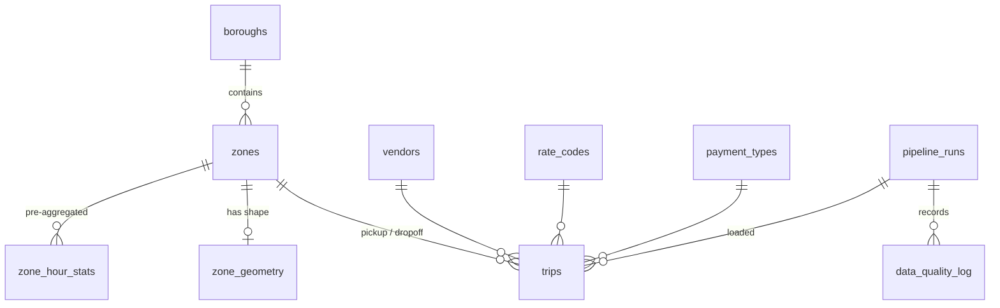

# Urban Mobility Data Explorer — *When the city slows down*

> **Where and at what hours does New York taxi speed collapse, and what does that congestion cost riders per mile?**

A full-stack data product built on one month of official NYC TLC yellow-taxi trip records. A Python ETL pipeline cleans the raw records, logs every exclusion and adds derived features. The cleaned data goes into a normalized SQLite database, a Flask API serves it, and a story-led dashboard shows a zone map, an hour × weekday heatmap, distributions, rankings, trip records and a data-quality panel.

- **Video walkthrough:** _add link here (check it opens in a private window)_
- **Live deployment:** _add Render/Railway URL here_
- **Team:** _names + GitHub usernames_

---

## Architecture

```mermaid
flowchart LR
    A[TLC files<br/>trips parquet · zone lookup CSV · zone shapefile] -->|raw rows| B
    subgraph B[pipeline/ — ETL]
      B1[extract] --> B2[validate<br/>drop rules] --> B3[clean<br/>normalise · map unknowns] --> B4[enrich<br/>derived features · quickselect IQR outliers] --> B5[load<br/>batched transactions]
    end
    B -->|cleaned trips · exclusion log| C[(SQLite<br/>dimensions · trips · zone_hour_stats · data_quality_log)]
    B -->|exclusion_log.csv| F[data/output/]
    C -->|SQL| D[Flask API<br/>api/ — filters · validation · min-heap top-k]
    D -->|JSON| E[Dashboard<br/>frontend/ — Leaflet map · heatmap · charts · tables]
```



| Layer | Folder | Notes |
|---|---|---|
| Configuration | `config.py` | every path, threshold and code dictionary in one place |
| Pipeline | `pipeline/` | `extract → validate → clean → enrich → load`, orchestrated by `pipeline/run.py` |
| Algorithms | `algorithms/` | hand-written quickselect quartiles and min-heap top-k (no `heapq`, `sorted`, `quantile`) |
| Database | `database/schema.sql` | normalized schema, foreign keys, CHECK constraints, indexes |
| API | `api/` | `filters.py` (validation and WHERE building), `queries.py` (SQL), `routes.py` (HTTP) |
| Frontend | `frontend/` | plain HTML/CSS/JS with Leaflet for the map |
| Tests | `tests/` | algorithm correctness, exact per-rule cleaning counts, API behaviour |

### Database schema



---

## Setup

Prerequisites: Python 3.10+ and git.

```bash
git clone <repo-url> && cd <repo>
python -m venv .venv
source .venv/bin/activate            # Windows: .venv\Scripts\activate
pip install -r requirements.txt
```

### Option A: quick start with the committed sample (for graders)

```bash
python -m pipeline.run               # builds data/urban_mobility.db from data/sample/
python app.py                        # http://localhost:5050
```

### Option B: full month

```bash
python scripts/download_data.py --month 2025-03   # ~60 MB into data/raw/
python -m pipeline.run                             # ~2–3 min for ~3.5M trips
python app.py
```

`pipeline.run` uses `data/raw/` if it has a month, otherwise `data/sample/`. Pass `--trips PATH` to choose a file or `--limit N` for a quick partial run. The database is rebuilt from scratch on every run.

To regenerate the committed sample after downloading: `python scripts/make_sample.py --rows 150000`.

### Tests

```bash
python -m pytest -q
```

---

## Data processing

The pipeline never drops silently. Each rule writes its count, threshold and up to five raw row numbers to the `data_quality_log` table and to `data/output/exclusion_log.csv`. The dashboard shows the same log in its *Data quality* panel. Drop rules run in sequence, so each excluded row is counted once and **raw − excluded = loaded** holds. A CHECK constraint on `pipeline_runs` enforces this.

| Stage | Rule | Action |
|---|---|---|
| validate | missing pickup/dropoff time, location, distance, fare or total | dropped |
| validate | pickup outside the file's month | dropped (log lists the years seen) |
| validate | dropoff ≤ pickup · under 1 min · over 6 h | dropped |
| validate | distance ≤ 0 · over 100 mi | dropped |
| validate | speed over 80 mph | dropped |
| validate | negative fare or total (refunds, disputes) | dropped (log breaks down by payment type) |
| validate | LocationID not in the zone lookup | dropped |
| validate | exact duplicates on vendor, times, zones, distance, total | dropped (first kept) |
| clean | passenger count / rate code / surcharges all null | kept, mapped to unknown |
| clean | unknown vendor, rate code (incl. 99) or payment code | mapped to the dictionary's "Unknown" |
| clean | passenger count 0 or over 9 | set to NULL |
| clean | zone 264 / 265 (Unknown / Outside NYC) | kept in counts, left off the map |
| enrich | speed or fare-per-mile outside Q1 − 3·IQR … Q3 + 3·IQR | flagged (`is_*_outlier`); the dashboard can hide them |

All thresholds live in `config.py`.

**Derived features:** `trip_duration_min`, `avg_speed_mph` (the congestion proxy), `fare_per_mile`, `tip_pct` (card trips only, because cash tips are not recorded), `pickup_date/hour/dow`, `is_weekend`, `time_band`, `is_airport_trip`, `is_cross_borough`, `pays_cbd_fee` (2025+ files only), and the two outlier flags.

## Custom algorithms

| Algorithm | File | Real problem it solves | Complexity |
|---|---|---|---|
| Quickselect (three-way partition) quartiles → IQR fences | `algorithms/quickselect.py` | Q1/Q3 of ~3M speeds and fare-per-mile values during cleaning, without sorting the column | expected O(n) time, O(1) extra for the selection |
| Binary min-heap top-k | `algorithms/topk_heap.py` | `/api/rankings` selects the top k of up to ~70,000 unordered origin–destination groups from SQL | O(g log k) time, O(k) space |

Pseudo-code and complexity notes are in each file's docstring. `tests/test_algorithms.py` checks both against numpy and `sorted()`.

## Indexing evidence

```bash
python scripts/explain_queries.py    # writes docs/evidence/query_plans.md
```

The script drops the trip indexes on a copy of the database, runs the API's real queries, rebuilds the indexes, runs them again, and records both query plans and timings.

---

## API reference

All endpoints accept the shared filters: `start_date`, `end_date` (YYYY-MM-DD), `hour_min`, `hour_max` (0–23, wraps midnight), `days` (e.g. `0,1,2,3,4`), `borough`, `zone`, `min_distance`, `max_distance`, `min_fare`, `max_fare`, `payment`, `exclude_outliers=1`. Invalid input returns HTTP 400 with `{"error": "..."}`.

| Endpoint | Returns |
|---|---|
| `GET /api/health` | status |
| `GET /api/meta` | story, latest run counts, date range, boroughs, zones, payment types |
| `GET /api/overview` | totals plus slowest and fastest hour |
| `GET /api/hourly` | metrics per pickup hour |
| `GET /api/map?metric=avg_speed\|fare_per_mile\|trips\|…` | one value per pickup zone |
| `GET /api/zones/geojson` | zone polygons (WGS84) |
| `GET /api/zones/<id>` | zone metrics, hourly profile, top 5 destinations |
| `GET /api/heatmap?metric=…` | 7 × 24 cells |
| `GET /api/distribution?metric=avg_speed_mph\|fare_per_mile\|trip_distance\|trip_duration_min&bins=20` | histogram |
| `GET /api/rankings?type=zones\|routes&by=trips\|slowest\|fastest\|fare_per_mile&k=10` | top-k via the custom heap |
| `GET /api/trips?sort=…&order=asc\|desc&page=1&page_size=25` | paginated trip records |
| `GET /api/trips/<id>` | full trip record with lookup descriptions |
| `GET /api/data-quality` | latest run and its exclusion log |

```bash
curl "http://localhost:5050/api/overview?days=0,1,2,3,4&hour_min=7&hour_max=10"
curl "http://localhost:5050/api/rankings?type=zones&by=slowest&k=5&borough=Manhattan"
```

**Pre-aggregation trade-off:** queries filtered only by date, hour, day, borough or zone are answered from `zone_hour_stats` (~200k rows) instead of `trips` (~3.5M). Any trip-level filter (distance, fare, payment, outliers) switches to a live query. Each response says which path it used in `source`. Tests check that both paths return identical numbers.

---

## Deployment

`render.yaml` deploys to Render's free tier. The build step installs requirements and runs the pipeline on the committed sample, and gunicorn serves `app:app`. A `Procfile` is included for Railway or Heroku-style hosts. Free instances sleep when idle, so keep the local setup as a fallback for the demo.

## Project structure

```text
├── app.py                  # entry point (python app.py / gunicorn app:app)
├── config.py               # paths, thresholds, data dictionary
├── algorithms/             # quickselect.py, topk_heap.py
├── api/                    # __init__.py (factory), filters.py, queries.py, routes.py
├── database/               # schema.sql, db.py
├── pipeline/               # extract, validate, clean, enrich, load, quality_log, run
├── scripts/                # download_data.py, make_sample.py, explain_queries.py
├── frontend/               # index.html, styles.css, script.js
├── tests/                  # test_algorithms.py, test_pipeline.py, test_api.py, fixture_data.py
├── data/
│   ├── raw/                # full downloads (git-ignored)
│   ├── sample/             # committed sample month
│   └── output/             # exclusion_log.csv, run_summary.json
├── docs/                   # technical report, evidence/query_plans.md
├── render.yaml, Procfile
└── requirements.txt
```

## Known limitations

- One month of yellow-taxi data. Green taxis and for-hire vehicles (Uber/Lyft) are not included, so "city speed" means yellow-taxi speed.
- Average speed is straight distance ÷ time, so it can't separate traffic from detours or waiting.
- Zones are assigned by pickup location. A trip that crawls through Midtown but starts elsewhere counts toward its pickup zone.
- SQLite suits a single-user dashboard. A multi-user production deployment would move to PostgreSQL/PostGIS.
